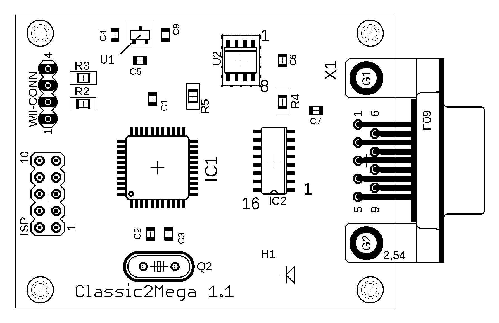
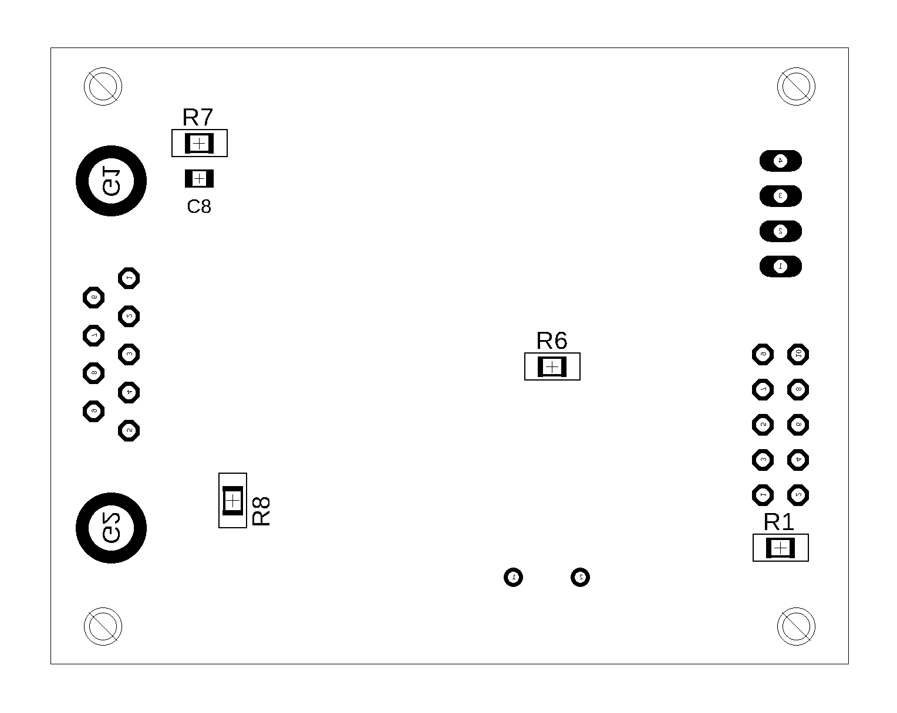

# Bauanleitung

Dieses Dokument beschreibt wie der Adapter gebaut werden kann.

## Schwierigkeitsgrad

Der Adapter verwendet bedrahtete Bauteile im DIP-Format für die ICs. Diese sind relativ einfach zu löten. Bauteile die weniger als 4 Kontakte aufweisen sind jedoch als SMD ausgeführt. Um diese Bauteile zu platzieren ist auf jeden Fall eine Pinzette erforderlich.

## Benötigte Materialien

Die benötigten Bauelemente sind in folgender Liste aufgeführt:

| Symbol | Name | Value | Package | Reichelt Number | Count |
|--------|------|------:|---------|---------------:|-----------------:|-------|
| U2,U3 | BSS 138 SMD | N-Channel MOSFET | SOT-23 | BSS 138 SMD | 2 |
| IC3 |Atmel ATMEGA 8A-PU|	|	DIL-28|	ATMEGA 8A-PU |	1|
| U1 |MICROCHIP MCP1700T-3302E/TT| 3.3V LDO |	SOT-23|	MCP 1700-3302|		1|
| IC2 |MC74HC157ADG|	|	DIL-16| 74HC 157|	1|
| H1 |OSRAM LT L29S-P2R1-25|	|	"0603"|	LT L29S |		1|
| Q2 |RALTRON AS-16.000-18 QUARZ |	|	HC49/S| 16,0000-HC49U-S|		1|
| C1,C6,C7 |Capacitor|	100nF|	“0805”|RND 1500805Y1041|		3|
| C2,C3 |Capacitor|	22pF|	“0805”|	NPO 0805 BG 22P|	2|
| C4,C5 |Capacitor|	1µF|	“0805”|	KEM X7R0805A1,0U|		2|
| C9 |Capacitor|	47µF|	“1210”|	X5R 1210 DC 47U|	1|
| C8 |Capacitor|	1nF|	“0805”|	NPO 0805 BG 1,0N|	1|
| ISP |STECKER,2REIHEN,5KONT| |			|MPE 087-2-010|		1|
| R1,R2,R3,R5,R6 |Resistor|	10k|	“0805”|	RND 0805 1 10K|		5|
| R7 |Resistor|	1M|	“0805”|	RND 0805 1 1,0M|		1|
| R8 |Resistor|	1.5k|	“0805”|	RND 0805 1 1,5K|		1|
| X1 |Con-subd|	|		|D-SUB BU 09EU|		1|

Hier ist eine vorbereiteter Warenkorb bei Reichelt, der alle benötigten Bauteile enthält.

https://www.reichelt.de/my/1487551

Darüberhinaus werden folgenden allgemeinere Werkzeuge benötigt:

 * Lötkolben
 * Lötzinn
 * (Optional) Flussmittel
 * SMD Pinzette
 * Seitenschneider
 * Programmieradapter für Atmel ATMega (auf ebay für unter 5€ zu bekommen, z.B. https://www.ebay.de/itm/162947756172)
 * Kabelbinder (Zur Zugentlastung des Wii-Kabels)
 * Scharfes Messer zur Bearbeitung des Gehäuses

## Top Layer

## Bottom Layer

